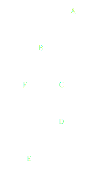
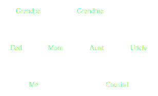
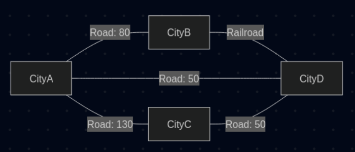

Philip og Peter Præsenterer

NebulaGraph

*(et Neo4j rip-off?)*

---

## Hvad er NebulaGraph?

- En graf database
- Ekstremt fokus på hastighed
- Stort fokus på skalerbarhed
- Indbygget sharding
- Bruger nGQL til forespørgsler

--

## Hvad er en graf

- data gemmes som knuder (*det hedder [det!](https://da.wikipedia.org/wiki/Knude_(graf))*)
- og bindes sammen med kanter

https://docs.nebula-graph.io/3.6.0/1.introduction/1.what-is-nebula-graph/

--

--

--

De vigtigste termer i NebulaGraph

| Term   | Betydning                                                     |
|--------|---------------------------------------------------------------|
| Space  | Selve databasen                                               |
| Edge   | En relation(stype) mellem knuder(vertices)                    |
| Tag    | Beskriver en rolle/type knuder kan have. Evt. med attributter |
| Vertex | En manifestering af en knude med en eller flere roller (tags) |

---

## Demo af opsætning

Beskriv det vigtigste i docker compose filen

Beskriv kort arkitekturen

https://docs.nebula-graph.io/3.6.0/1.introduction/3.nebula-graph-architecture/1.architecture-overview/

og de tre services

---

# Demo 1 af 2

--

For at oprette en database

    CREATE SPACE helloworld (VID_TYPE=FIXED_STRING(32));

Vi kan se den med

    SHOW SPACES;
    DESCRIBE SPACE helloworld;

--

Et schema består af TAGs og EDGEs

Hvis vi vil repræsentere et "vej"-net skal vi bruge byer og veje:

    CREATE TAG city (name string, population int, founded int);

    SHOW TAGS;

    CREATE EDGE road (speed_limit int);
    CREATE EDGE railroad ();

    SHOW EDGES;

--

Vi indsætter data i databasen:

    INSERT VERTEX city(name, population, founded) VALUES
    "Aalborg":("Aalborg", 120000, 1035),
    "Bjerringbro":("Bjerringbro", 7500, 1863),
    "Christiansfeld":("Christiansfeld", 3000, 1773),
    "Dybbøl":("Dybbøl", 2500, 1352);

    MATCH (all_vertices) RETURN all_vertices;

    INSERT EDGE road(speed_limit) VALUES
    "Aalborg"->"Bjerringbro":(80),
    "Bjerringbro"->"Aalborg":(80),
    "Aalborg"->"Christiansfeld":(130),
    "Christiansfeld"->"Aalborg":(130),
    "Aalborg"->"Dybbøl":(50),
    "Dybbøl"->"Aalborg":(50),
    "Christiansfeld"->"Dybbøl":(50),
    "Dybbøl"->"Christiansfeld":(50);

    INSERT EDGE railroad() VALUES
    "Bjerringbro"->"Dybbøl":(),
    "Dybbøl"->"Bjerringbro":();

    MATCH ()<-[all_edges]-() RETURN all_edges;

--

--

Find alle veje fra B til C

    FIND NOLOOP PATH
    FROM "Bjerringbro" TO "Christiansfeld"
    OVER road YIELD PATH AS `Korteste vej`;

Den langsommeste vej

    FIND NOLOOP PATH WITH PROP
    FROM "Bjerringbro" TO "Christiansfeld"
    OVER road YIELD PATH AS p
    | YIELD [v IN nodes($-.p) | v.city.name] AS `Langsomste vej`, reduce(speed_limits = 0, r IN relationships($-.p)
    | speed_limits + r.speed_limit) AS speed
    | ORDER BY $-.speed ASC | LIMIT 1;

--

## CRUD-funktionalitet

Demonstrer, hvordan man kan oprette, læse, opdatere og slette data (CRUD-operationer) i databasen. Vis konkrete eksempler på, hvordan dette udføres i den valgte database.

--

## CRUD-funktionalitet
Demonstrér hvordan Create, Read, Update og Delete-operationer (CRUD) udføres i databasen. Præsentér konkrete eksempler på implementering af disse operationer.

---

## Fordele og ulemper

Analysér databasens styrker og svagheder. Identificér hvilke typer applikationer databasen er velegnet til, samt i hvilke sammenhænge den er mindre hensigtsmæssig.

--

## Parlør

SPACE ~= DATABASE

TAG ~= TABLE

EDGE ~= TABLE

---

## Refleksion

Reflektér over hvornår og hvordan denne database udgør det optimale valg i et praktisk projekt, samt identificér situationer hvor alternative databasetyper ville være mere hensigtsmæssige.

---

## Yderligere emner

Undersøg andre relevante emner for databasetypen, eksempelvis:
- Skalerbarhed
- Performance
- Håndtering af store datamængder
- Sikkerhed
- Data-redundans

---
